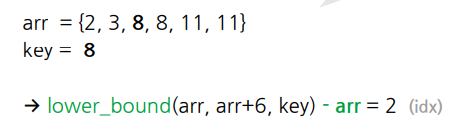
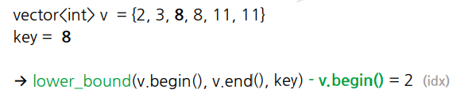
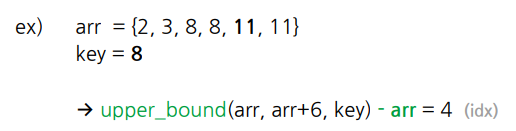
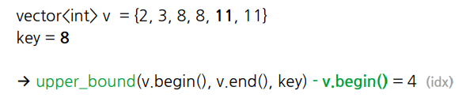

# 07. Divide and Conquer

## 분할탐색
### 정의
> 병합 횟수 : logN
하나의 큰 문제를 작은 문제로 **분할하여** 문제를 해결하는 방법

- [Divide] 문제를 둘 이상의 부분 문제로 나눈 뒤
- [Conquer] 각 문제에 대한 답을 계산하고
- [Merge] 원래 문제에 대한 답으로 병합

### 분할정복 vs DP
- 공통점 : 큰 문제를 작은 문제 여러 개로 나눠서 해결
- 차이점
  - DnC : 중복되는 부분 문제 없이 완벽하게 분할
  - DP : 중복되는 문제 발생 -> memorization으로 해결

### 구조
재귀적으로 자신을 호출하면서 연산의 단위를 조금씩 줄여가는 구조

### 응용 - 병합 정렬
> 수열을 반복적으로 쪼개고 합쳐서 정렬하는 방식 : O(NlogN)
- [Divide] 수열을 절반의 크기로 쪼갠다
- [Conquer] 나뉜 수열들끼리 정렬한다
- [Merge] 부분적으로 정렬된 수열을 병합

```
void MergeSort(start, end) {
  // Conquer
  if (start >= end){
    return;
  }
  
  // Divide
  mid = (start + end) / 2;
  MergeSort(start, mid);
  MergeSort(mid+1, end);
  
  // Merge
  Merge(start, end);
}
```

### 모듈로 연산
(a+b) % m = ((a%m) + (b%m) % m)

### 장단점
- 장점
  - 문제를 나눔으로써 어려운 문제 해결 가능
  - 병렬적으로 문제 해결 -> 시간 단축
  <br><br>
- 단점
  - 함수를 재귀적으로 호출
  - 과도한 메모리 사용

## 이분탐색
### 정의
- 오름차순으로 **정렬**된 리스트에서 특정한 값의 **위치**를 찾는 알고리즘
- 탐색 구간의 중앙값과 찾고자 하는 값과의 대소 비교를 통해 다음 탐색 구간 설정

### 구조
1) 중앙값을 임의의 값으로 선택
2) 선택한 중앙값이 찾는 값보다
- 크면 그 값이 새로운 최댓값
- 작으면 그 값이 새로운 최솟값

#### 재귀
```
int BinarySearch(low, high){
  if (low > high) {
    return -1;
  }
  
  mid = (low + high)/2
  
  if (ans < arr[mid){
    BinarySearch(low, mid+1);
  } else if (arr[mid] < ans){
    BinarySearch(mid+1, high);
  } else {
    return mid;
  }
}
```

#### 반복
```
int BinarySearch(ans) {
  low = 0;
  high = n-1;

  while(low < high){
    mid = (low + high)/2;

    if (arr[mid]>ans){
      high = mid-1;
    } else if (arr[mid]<ans){
      low = mid+1;
    } else {
      return mid;
    }
  }
  return -1; // not found
}
```

### 함수
> 인덱스가 아닌 주소값 iterator 반환 | 정렬이 되어 있어야만 사용 가능

1) lower_bound
> key **이상**의 값이 처음 나오는 위치 반환




2) upper_bound
> key **초과**의 값이 처음 나오는 위치 반환




3) 중복값이 존재하는 배열 안에 특정 원소 반복 횟수 <br>
```upper_bound - lower_bound```

### 좌표 압축
> 간격 또는 중복 정보를 제거하여 많은 점 집합을 **더 작은 범위에 mapping하는 기법**

- 실제 간격의 정보가 덜 중요할 때
- 중복값이 많고 상대적인 **순서**만 알아도 될 때
- 좌표상에서 범위는 크지만 실제 점 개수는 적을 때
```
	sort(num.begin(), num.end());
	num.erase(unique(num.begin(), num.end()), num.end());
	for (int i=0; i<n; i++){
		arr[i] = lower_bound(num.begin(), num.end(), arr[i]) - num.begin();	
	}
```

- unique 함수
  - 중복되는 원소들을 뒤로 빼는 함수
  - 중복이 시작되는 위치 리턴
- erase 함수
  - 중복이 시작되는 위치부터 끝까지 중복 원소 제거

### 매개변수 탐색 parametric search
> 최적화 문제를 결정 문제로 바꾸어 푸는 기법

1) 결정 문제 : 답변이 true/false 형태로 나오는 문제
2) 최적화 문제 : 최솟값/최댓값을 구하는 문제
<br><br>
- 특정 parameter를 기준으로 조건을 만족하는 부분과 만족하지 않는 경계점 탐색
<br><br>
1) 정답을 매개변수로 만들고 yes/no 문제로 바꿔보기
2) 모든 문제에 대해서 yes/no를 채웠다고 생각했을 때 정렬된 상태인가?
3) yes/no를 결정하는 문제로 해결하기

### 다시 돌아온 LIS
단순히 부분 수열의 길이를 구하는 것이라면 아래 알고리즘 활용 가능
```
v.push_back(A[0]);

for (int i=1; i<n; i++){
  // 맨 뒷자리에 바로 넣는 경우(증가)
  if (v.back() < A[i]){
    v.push_back(A[i]);
  } 
  // 이전 자리를 찾아서 넣어주는 경우
  else {
    auto it = lower_bound(v.begin(), v.end(), A[i]);
    *it = A[i]; // A[i] 이상의 값을 갖는 첫 번째 위치에 A[i] 삽입
   }
}
cout << v.size();
```