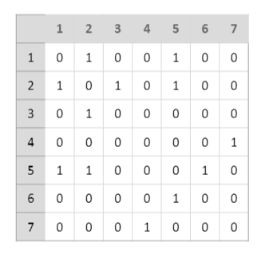
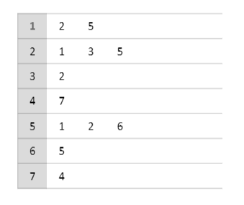
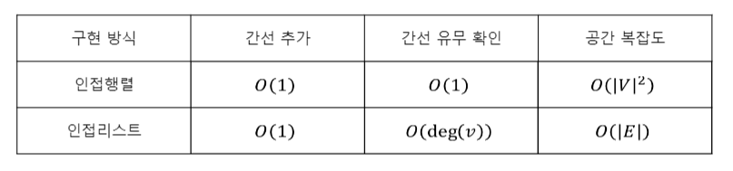

# 08. Graph

## 1. Graph
### 1) 그래프 Graph G
- 정점(vertex, node)과 간선(edge, link)의 집합으로 이루어진 자료구조
- G = (V, E)로 표현

### 2) 용어
1) 정점 vertex V : 연결 관계의 대상들
2) 간선 edge E : 연결 관계
3) 인접하다 adjacent : 간선으로 이어진 두 정점
4) 차수 degree : 정점에 연결된 간선의 수
5) 경로 path : 중복되지 않는 정점의 나열로서, 인접한 정점 사이에 간선이 있는 경우
6) 루프 loop : 어떠한 정점에서 나와서 다시 그 정점으로 들어가는 간선

### 3) 종류
### (1) 연결
- 연결 그래프 : 임의의 두 정점 사이에 경로가 존재하는 그래프
- 비연결 그래프 : 연결 그래프가 아닌 그래프

### (2) 방향
- 방향 그래프 : 간선의 방향이 존재하는 그래프
- 무방향 그래프 : 간선의 방향이 없는 그래프 

#### 차수 
- 진입 차수 indegree : 해당 정점이 종점인 간선의 수(deg-)
- 진출 차수 outdegree : 해당 정점이 시점인 간선의 수(deg+)

##### 성질
- 방향 그래프 : deg-(v) = deg+(v) = |E|
- 무방향 그래프 : deg(v) = 2|E|

### (3) 순환
> 시작점과 끝점만 동일한 정점의 나열 <br>인접한 정점 사이에 간선이 있는 경우
- 순환 그래프 : cycle을 가지는 그래프
- 비순환 그래프 acyclic graph : cycle을 가지지 않는 그래프
  - 방향 그래프 : 유향 비순환 그래프(사이클 X, 방향 o)
  - 무방향 그래프 
    - 연결 그래프 : 트리
    - 비연결 그래프 : 포레스트 forest

### (4) 다중/단순 그래프
- 다중 그래프 : 간선의 중복과 루프를 허용하는 그래프
- 단순 그래프 : 간선의 중복과 루프가 없는 그래프

### (5) 가중
- 가중 그래프 : 간선에 가중치가 존재하는 그래프
- 비가중 그래프 : 간선에 가중치가 없는 그래프

## 2. Graph Representation
### 인접 행렬 adjacency matrix
> 이차원 배열을 이용하여 구현<br> 간선 수가 많은 경우 사용


- 시간 복잡도
  - 간선 추가 O(1)
  - 간선 판별 O(1)

- 공간 복잡도 : O(|V|^2)

### 인접 리스트 adjacency list
> 이차원 벡터를 이용하여 구현 <br> 정점 수가 많은 경우 사용
- 해당 정점에서 나가는 간선과 연결된 정점을 저장
- 가중 그래프에서는 {정점, 가중치}로 저장<br><br>

- 시간 복잡도
  - 간선 추가 O(1)
  - 간선 판별 O(deg(V)

- 공간 복잡도 : O(|E|)

### 인접 행렬 VS 인접 리스트
> 인접 리스트를 주로 사용!


대부분의 문제들이 간선에 비해 정점 개수가 많기도 하고, 특정 노드에 연결된 모든 노드를 찾는 경우가 많음

## 3. Graph Search
### DFS
> 백트래킹, 사이클 검출
- 스택
```
  void dfs(int start){
    stack>int> st;
    st.push(start);
    visited[start] = true;
  
    while(!st.empty()){
        int cur = st.top(); st.pop();
        for (int next : adj[cur]){
            if (!visited[next]){
                visited[next] = 1;
                st.push(next);
            }
        }
    }
  
  }
  ```
- 재귀 함수
   ```
  void dfs(int cur){
    visited[cur] = true;
    for (auto &next : adj[cur])
        if (!visited[next]) dfs(next);
  }
  ```

  
### BFS
> 최단거리 찾기

```
void bfs(int start){
    queue<int> q;
    q.push(start);
    visited[start] = 1;

    while (!q.empty()){
        int cur = q.top(); q.pop();
        for (int next : adj[cur]){
            if (!visited[next]){
                visited[next] = 1;
                dist[next] = dist[cur] + 1; // 최단거리
                q.push(next);
            }
        }
    }
}
```
