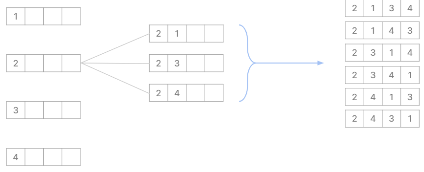

# 02. Linear Data Structure

## 1. 선형 자료구조
(1) 선형 자료구조
- 자료 간 관계가 1:1인 선형 구조
- 스택, 큐, 덱

(2) 비선형 자료구조
- 자료 간 관계가 1:n 혹은 n:n 구조인 비선형 구조
- 그래프, 트리

## 2. 스택/큐/덱
### 스택
> LIFO(Last In First Out)
> 중간 원소를 삽입/삭제/탐색하지 않는 경우
```
push() : 원소 삽입
pop() : 원소 삭제
top() : 가장 위에 있는 원소
size() : 스택에 들어있는 원소의 개수
empty() : 스택이 비어 있는지 확인
```

- 후위 표기법 계산<br><br>
- 재귀 알고리즘
  - 함수에서 자신을 다시 호출하여 작업을 수행하는 방식
  - 순열 만들기<br><br>
  
<br><br>
- 모노톤 스택
  - 단조로운 스택
  - 오름/내림차순을 유지한 스택 
  - 중복 없는 내림차순 : (top <= 들어가려는 수)일 때 pop 반복

### 큐
> FIFO(First In First Out)
> 입력된 순서대로 데이터를 처리하는 경우
```
push()
pop()
front() : 큐의 맨 앞
rear() : 큐의 맨 뒤
size() : 큐에 들어있는 원소의 개수
empty() 
```

- 너비 우선 탐색(BFS) 알고리즘 : 앞으로 방문할 노드를 순서대로 큐에 넣음
<br><Br>
- 선형 큐 : 데이터가 없을 때에도 비어있는 공간 활용 불가능
- 원형 큐 : 메모리 절약 가능

### 스택 vs 큐
- 장점
  > 시간 복잡도 O(1)
  - 데이터의 삽입 & 삭제 빠름
  - 특정 위치 원소 접근 빠름<br><br>
- 단점
  - 특정 위치 원소만 접근 가능
  - 이외에는 random access 불가능

### 덱
> Double-ended queue <br>
> 양쪽에서 삽입, 삭제 모두 가능<br>
> 인덱스 접근 가능
```
push_front, push_back
pop_front, pop_back
front, rear
size
empty
```
- 주로 앞과 뒤에서 삽입/삭제 일어날 때<br><br>
- 데이터 개수가 가변적일 때 : 메모리 공간 자동으로 확장/축소<br><br>
- 큐를 사용하는데 **회전시키거나 뒤집어야 할 때**<br><br>
- 인덱스에 접근해야 할 때 : 주로 array / vector 사용<br><br>
- 선형 공간을 2회 이상 반복적으로 탐색할 때
  > O(N^2) -> O(N)
  - **Sliding window** <br>
    - **고정된** 길이의 윈도우를 이동시키면서 윈도우 내의 데이터 이동<br>
    - 일정 범위의 구간 내에서 최소/최대값 구할 때<br><br>
  - **Two pointer** (start & end) <br>
    - 부분 범위의 길이가 **가변적**<br>
    - 주로 정렬된 배열에서 이용
    
## 3. 적절한 자료구조 선택하기
0) 배열 사용 고려 -> 메모리 과다 사용 / 원소 삽입*삭제가 반복되는 경우 자료구조 사용 고려
1) 삽입/삭제가 **한쪽 끝**에서만 발생하는가? - 스택<br><br>
2) 양쪽 끝에서 삽입/삭제가 **서로 반대 방향**에서 발생하는가? - 큐 <br><br>
3) 양쪽 끝에서 삽입/삭제가 **모두** 발생하는가? - 덱

