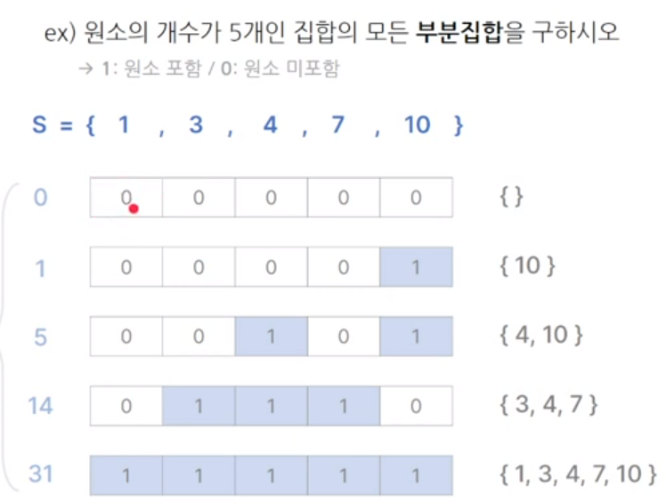

# 03. Bruteforcing, Backtracking

## 완전 탐색

### 정의
- 모든 경우의 수를 찾아서 답을 찾는 방법
- 가장 확실한 방법이지만 가장 시간이 오래 걸리는 방법
- 입력(N) 제한이 적다면 완전탐색인지 의심해보자<br><br>
### 종류
- 브루트포스 : 반복/조건문을 활용해 모두 테스트하는 방법
- 비트마스크 : 2진수 표현 기법을 활용하는 방법
- 재귀 : 자기 자신을 호출하여 작업을 반복 수행하는 방법(종료조건 & 점화식)
- 순열 : n개의 원소 중 r개의 원소를 중복 허용 없이 나열하는 방법
- DFS, BFS : 그래프에서 모든 정점을 탐색하는 방법
  <br><br>

### 브루트 포스
> 단순히 for문과 if문 등으로 모든 경우들을 만들어 답을 구함


### 비트마스크
> 2진수 이용(모든 경우의 수가 1 또는 0으로 구성)



### 재귀
> 자기 자신을 호출하는 함수
1) 공통 작업 (선택)
2) 종료 조건 (기저 사례)
3) 현재 단계에서 수행할 작업
4) 다음 단계 (점화식)

### 순열
> 서로 다른 N개를 일렬로 나열하는 모든 경우의 수 - O(N!)

<br>

#### 순열에 원소를 하나씩 채워가는 방식
1) 단순 중첩 for문으로 구현 가능
2) 재귀함수로 깔끔하게
```
int arr[5] = {1, 2, 3, 4, 5};
bool isSelected[5];
int perm[5];

void recur(int idx){
  if (idx == 5){
    // 순열 출력
    for (int i=0; i<5; i++)
      cout << perm[i] << ' ';
    cout << "\n";
    return;
  }
  for (int i=0; i<5; i++){
    if (isSelected[i])
      continue;
    perm[idx] = arr[i];
    isSelected[i] = true;
    recur(idx+1);
    perm[idx] = 0;
    isSelected[i] = false;
  }
}
```
3) next_permutation
- 미리 오름차순 정렬
- 오름차순으로 순열 생성
```
int arr[5] = {5, 3, 1, 4, 2};
int main() {
  sort(arr, arr+5); // 미리 정렬
  do {
    // 순열 출력
    for (int i=0; i<5; i++)
      cout << arr[i] << ' ';
    cout << "\n";
  } while (next_permutation(arr, arr+5));
}
```

<br>

### DFS, BFS
> 모든 곳을 다 방문
- DFS : 깊이 우선 탐색
- BFS : 너비 우선 탐색
<br>

## 백트래킹
### 정의
- 한정된 조건을 가진 문제를 풀려는 전략
- 가지치기(Pruning)
- 시간이 오래 걸린다는 완전탐색의 단점 보완 <br><br>
### 구조
1) 종료 조건
2) 반복문
3) 제한 조건
4) 상태 변화
5) 다음 단계
6) 상태 복구

## 완전탐색 vs 백트래킹
### 완전탐색
- 가능한 모든 경우의 수 탐색
- 시간이 오래 걸림
- 브루트 포스, DFS/BFS <br><br>
### 백트래킹
- 가지치기를 통해 조건에 어긋나는 경우는 탐색 X
- 완전탐색보다 시간 단축 (제한 조건 많을수록 더 많이 단축)
- 주로 재귀함수로 구현

## 순열 & 조합
### 순열 (next_permutation)
1) 미리 오름차순 정렬된 배열 필요
2) 자동 중복 제거
```
vector<int> v{1, 2, 3};
sort(v.begin(), v.end());

do {
  for (auto num : v){
    cout << v << ' ';
  }
  cout << "\n";
} while (next_permutation(v.begin(), v.end()));
```

### 조합(prev_permutation)
1) next_permutation = 오름차순 정렬 -> 조합 내림차순 정렬
2) prev_permuatation = 내림차순 정렬 -> 조합 오름차순 정렬
```
vector<int> v{1, 2, 3, 4};
vector<int> temp{1, 1, 0, 0};

do {
  for (int i=0; i<v.size(); i++){
    if (temp[i] == 1){
      cout << v[i] << " ";
    }
    cout << "\n";
  }
} while (prev_permuation(temp.begin(), temp.end()));
```