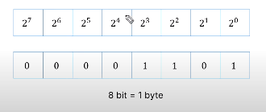
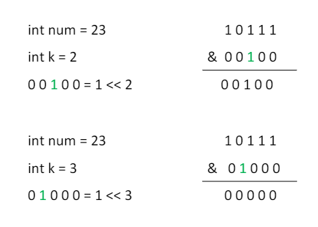
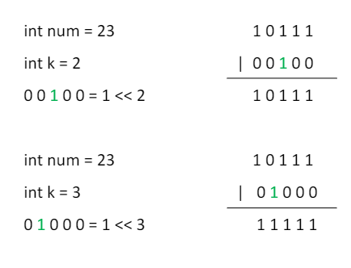
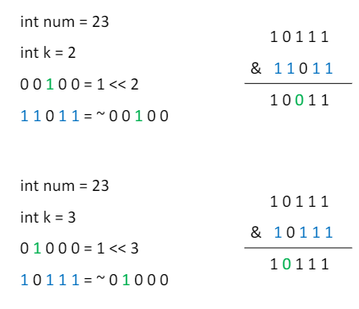

# Basic Math

## 1. 유클리드 호제법 Euclidean Algorithm
> 최대공약수와 최소공배수 구하기

### 최대공약수 GCD greatest common divisor
> 두 자연수의 공통된 약수 중 가장 큰 수 O <br>
> (log(max(a ,b)))
- 두 수의 공약수는 두 수의 최대공약수의 약수와 같다
- A = BQ + R (Q : 몫, R : 나머지)일 때, **GCD(A, B) = GCD(B, R)** <br>
ex) gcd(20, 12) = gcd(12, 8) = gcd(8, 4) = gcd(4, 0) = 4 <br><br>

```
// 재귀
int gcd(int a, int b) {
    if (!b) {
        return a;
    }
    return gcd(b, a%b);
}
```

```
// 반복
int gcd(int a, int b) {
    while(b){
        int r = a%b;
        a = b;
        b = r;
    }
    return a;
}
```

```
#include <numeric> // c++17
```

### 최소공배수 LCM least common multiplier
> 두 자연수의 공통된 배수 중 가장 작은 수
- A*B = GCD(A, B) * LCM(A, B)
```
int lcm(int a, int b) {
    return a / gcd(a, b) * b; // 오버플로수 방지
}
```

## 2. 에라토스테네스의 체 Sieve of Erastosthenes
> 소수 구하기 O(sqrt(n))

### 소수
> 1보다 큰 자연수 중에서 약수가 1과 자기 자신뿐인 수 <br>
> 2부터 n-1까지의 수로 나누어지지 않는 수

```
bool isPrime(int n) {
    if (n==1){
        return 0;
    }
    for (int i=2; i*i<=n; i++){
        if (n % i == 0){
            return 0;
        }
    }
    return 1;
}
```

### 에라토스테네스의 체
> N보다 작거나 같은 모든 소수를 찾는 알고리즘 O(Nlog(logN))
1) 2~N까지 모든 정수를 적는다
2) 남은 수중에서 아직 처리하지 않은 가장 작은 소수 P를 찾는다
3) 남은 수 중에서 P의 배수를 모두 제거한다
4) 더 이상 반복할 수 없을 때까지 2번과 3번 과정을 반복한다

```
#include <iostream>
#include <vector>
using namespace std;

int main() {
    vector<int> prime; // 소수 저장
    bool isprime[N+1]; // 소수 여부 저장
    fill(N+2, isprime+N+1, true);
    
    for (int i=2; i*i<=N; i++){
        // 소수가 아닌 경우 continue
        if (!isprime[i]){
            continue;
        }
        // 소수 저장
        prime.push_back(i);
        // 소수의 배수 제거
        for (int j=i*i; j<=N; j+=i){
            isprime[j] = false;
        }
    }
}
```

### 소인수분해
> 정수를 소수의 곱으로 나타내는 것 <br>
> N 이하의 모든 소스를 에라토스테네스의 체로 다 찾은 다음, 그 소수들로 N을 나눠보기

```
int N;
cin >> N;

vector<int> prime;
bool isPrime[N+1];
fill(isPrime+2, isPrime+N+1, true);

for (int i=2; i<=N; i++){
    if (isPrime[i]){
        prime.push_back(i);
        for (int j=i*2; j<=N; j+=i){
            isPrime[i] = false;
        }
    }
}

// 소인수분해
for (int i=0; N>1; i++){
    while (N % prime[i] == 0){
        cout << prime[i] << " ";
        N /= prime[i];
    }
}

```

### 소인수분해 개선
> 브루트포스로 접근 O(sqrt(N))
- i가 2부터 시작해서 1씩 증가하면서 **N이 i로 나누어지지 않을 때까지 나누고** i를 소인수 목록에 추가
- 소인수 목록에 적힌 수들의 곱은 N
- 목록에 있는 수들은 전부 소수

```
#include <iostream>
using namespace std;

int main() {
    int N;
    
    cin >> N;
    for (int i=2; i*i<=N; i++){
        while(N % i == 0){
            cout << i << " ";
            N /= i;
        }
    }
    
    if (N != 1){
        cout << N;
    }
    return 0;
}
```

## 3. 비트마스킹 Bit Masking
> 이진수를 사용하는 컴퓨터의 연산 방식을 이용하여, 정수의 이진수 표현을 자료 구조로 쓰는 기법



### 장점
- 수행 시간이 빠르다
- 코드가 간결하다
- 메모리 사용량이 더 적다

### 비트 연산자 Bitwise Operator
> bit 단위로 논리 연산을 할 때 사용하는 연산자 <br>
> 비트 단위로 전체 비트를 왼쪽이나 오른쪽으로 이동시킬 때도 사용

- 비교 연산자보다 비트 연산자의 우선순위가 낮기 때문에 사용 시 괄호 필요! <BR><BR>

- & : 비트 AND 연산
- | : 비트 OR 연산
- ^ : 비트 XOR 연산 (서로 다르면 1 반환)
- ~ : 비트 NOT 연산
- << : LEFT SHIFT 연산 (지정한 수만큼 비트들을 전부 왼쪽으로 이동)
- \>> : RIGHT SHIFT 연산 (부호를 유지하면서 지정한 수만큼 비트들을 전부 오른쪽으로 이동)

### 자주 쓰이는 비트 연산
#### 1) K번쨰 비트가 1인지 0인지 확인하기
> num & ( 1 << k)의 결과가 0인지 확인


```
bool getBit(int num, int k){
    return (num && (1 << k)) != 0;
}
```

#### 2) K번째 비트를 1로 만들기
> num = num | (1 << k)


```
int setBit(int num, int k){
    return num | (1 << k);
}
```

#### 3) K번째 비트를 0으로 만들기
> num = num & ~(1 << k)


```
int clearBit(int num, int k){
    return num & ~(1 << k);
}
```
