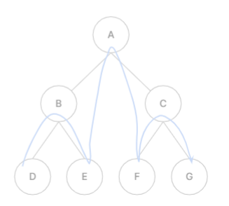
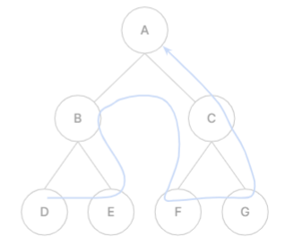
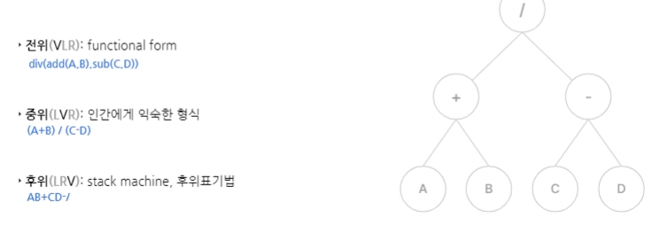
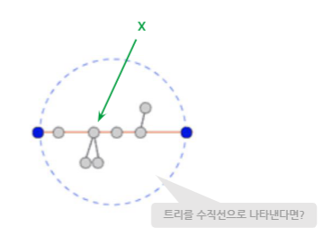
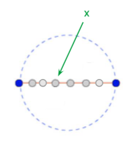

# 09. 트리

## 1. 트리
> 연결 그래프 && 비순환 그래프

### 그래프와 트리
모든 연결 그래프는 spanning tree를 만들 수 있음
- 그래프 내의 모든 정점을 포함하는 트리
- 그래프의 부분 집합

### 용어 정리
- 노드 : 트리를 구성하는 정점
- 간선 : 부모 노드와 자식 노드 관계의 연결선
- **루트 노드** : 트리의 시작 노드
- 리프 노드 : 자식 노드가 없는 노드
- 부모(자식) 노드 : 연결된 두 노드 중 상위(하위) 노드
- 형제 노드 : 동일한 부모 노드를 갖는 노드들
- 조상 노드 : 부모 노드들의 집합
- 자손 노드 : 자식 노드들의 집합
<br><br>
- **서브트리** : 어떤 노드 n과 그 자손들로 구성된 트리
- 차수
  - 노드의 차수 : 노드에 연결된 자식 노드의 수
  - 트리의 차수 : 트리에 있는 노드의 차수 중 최댓값
- 노드의 **레벨** : 루트 노드 - 현재 노드까지의 간선 수
- 높이
  - 노드의 높이 : 노드의 레벨
  - 트리의 높이 : 트리에 있는 노드의 높이 중 최댓값

### 정의
> 비순환 연결 그래프
> 속성 3가지 중 하나만 만족해도 서로 만족함
- 임의의 두 정점 사이의 단순 **경로 유입**
- **(간선의 수) = (정점의 수) - 1**
- 순환하는 경로가 없음

### 특징
- 하나의 루트 노드를 가진다
- 루트 노드는 0개 이상의 자식 노드를 가진다
- 그 자식 노드도 0개 이상의 자식 노드를 가지고, 이는 **반복**적으로 정의된다.

## 2. 이진 트리
> 각각의 노드가 최대 2개의 자식 노드를 갖는 트리 <br><br>
> 왼쪽 & 오른쪽 서브트리가 모두 이진트리

- 높이가 (h-1)인 이진트리의 노드 수는 h ~ (2^h - 1)
  - 최소 : 편향, 최대 : 포화
  - 높이 0 ~ h-1

### 편향 이진트리
> 모든 노드가 하나의 차수로만 이루어져 있는 이진트리
- 노드 수 : h개 (트리 높이 : h-1)
- 노드 탐색 시 걸리는 시간 : O(N)

### 완전 이진트리
> 마지막 레벨을 제외하고 **모든 레벨이 채워져 있으며** 마지막 레벨은 **왼쪽**부터 채워진 이진트리
- 힙에 사용되는 자료구조

### 포화 이진트리
> 리프 노드를 제외하고 **모든 노드의 차수가 2개**로 이루어져 있는 이진트리
- 노드 수 : 2^h - 1개 (트리 높이 : h-1)
- 노드 수 파악하기 쉬움

## 3. 힙 heap
> 최댓값 / 최솟값을 빠르게 찾기 위해 고안된 완전 이진트리
- 각 노드에 key & element 저장
- 주로 이진 힙 사용

### 속성
> 부모-자식의 key값 사이에 대소관계 성립

- 최대힙 : key(T.parent(v)) > key(v)
- 최소힙 : key(T.parent(v)) < key(v)
<br><br>
- 가장 높은/낮은 우선순위를 갖는 노드가 항상 뿌리노드에 옴
  <br>=> **우선순위 큐** 구현할 때 사용

### 구현
- 배열로 구현
- i번째 노드의 
  - 왼쪽 자식 i*2
  - 오른쪽 자식 i*2 + 1
  - 부모 i/2

#### 삽입
- 우선 마지막 노드에 연결
- 부모 노드와 계속 비교하면서 swap

#### 삭제
- 루트 노드 삭제
- 가장 마지막 값을 루트 노드로 옮김
- 자식 노드와 계속 비교하면서 swap
  - if 자식 노드 둘 다와 swap해야 하는 경우
    - 최대힙 : 더 큰 값과 swap
    - 최소힙 : 더 작은 값과 swap

### 시간 복잡도
- 높이 : O(logN) (원소의 개수 N)
- 삽입 : O(logN)
- 삭제 : O(logN)
- 접근 : O(1) (배열 접근과 동일)

## 4. 이진 탐색 트리 BST
> O(logN) 

- 모든 노드에 값이 있음
- **값들은 전순서가 있음(비교 가능, 중복 X)**
- **모든 왼쪽 자식들 <= i <= 모든 오른쪽 자식들**
- 좌우 서브트리는 다시 BST

### 탐색 과정
> O(logN)

트리에 찾고자 하는 값의 노드 존재하면 해당 노드 리턴, 없으면 NULL 반환
1) 찾고자 하는 값과 루트 노드 비교
2) 찾고자 하는 값이 루트 노드보다
   - 작으면 왼쪽 서브트리로 이동
   - 크면 오른쪽 서브트리로 이동

### 시간복잡도
원소를 넣는 순서에 따라 높이가 달라짐
- 최악 O(N)
- 평균 O(logN)
=> 자가 균형 BST : Red-Black Tree, AVL Tree, Splay Tree

### STL
> set, map
- red-black tree 기반
- 탐색, 삽입, 삭제 평균 O(logN)

```
#include <set>
using namespace std;

set<int> s;

int main() {
  s.insert(3);
  
  if (s.find(3) == s.end()){
    cout << "not found";
  } else {
    cout << "found";
  }
  
  s.erase(s.find(3));
}
```

```
#include <map>
using namespace std;

map<string, int> s;
int main() {
  m.insert({"txt", 304});
  
  if (s.find("txt")==s.end()){
    cout << "not found";
  } else {
    cout << "found";
  }
  
  s.erase(s.find("txt"));
}
```

## 5. 트리 순회 tree traversal
1) 일반 트리에서의 순회
- 그래프 순회하듯이 DFS
- 트리도 그래프의 일종

2) 이진 트리에서의 순회

### 이진 트리 순회
#### 전위 Preorder
> VLR
- 깊이 우선 순회


#### 중위 Inorder
> [LVR] 오름차순으로 값 가져올 때 사용<br>
> [RVL] 내림차순으로 값 가져올 때 사용
- 대칭 순회


```
void inorder(Node* curr){
  if (curr != null){
    inorder(cur->left);
    cout << curr->data << ' ';
    inorder(curr->right);
  }
}
```

#### 후위 Postorder
> [LRV] 트리에서 원소 삭제할 때 사용



#### 순회 응용


## 6. 트리의 지름
> 트리의 모든 경로들 중 가장 긴 경로의 길이

 


1. 트리에서 임의의 정점 x를 잡는다
2. 정점 x에서 **가장 먼 정점 a**를 찾는다
3. 정점 a에서 **가장 먼 정점 b**를 찾는다
=> DFS 2번만에 트리의 지름을 구할 수 있음!